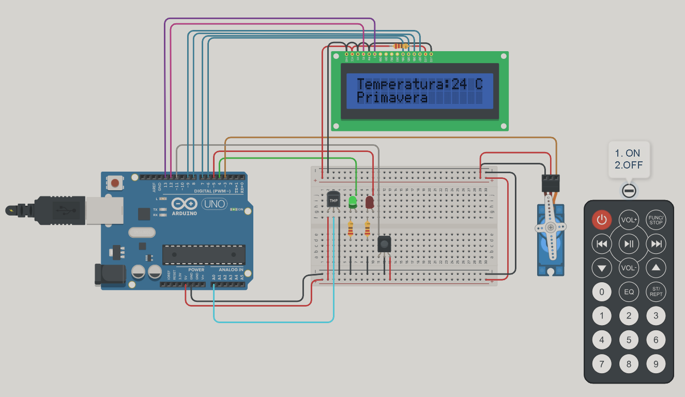
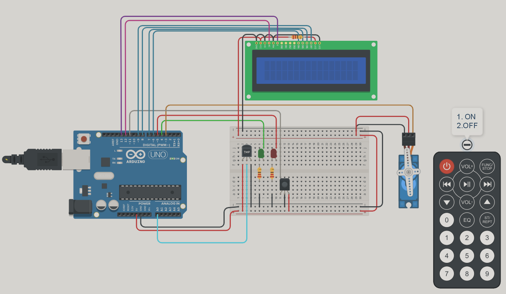
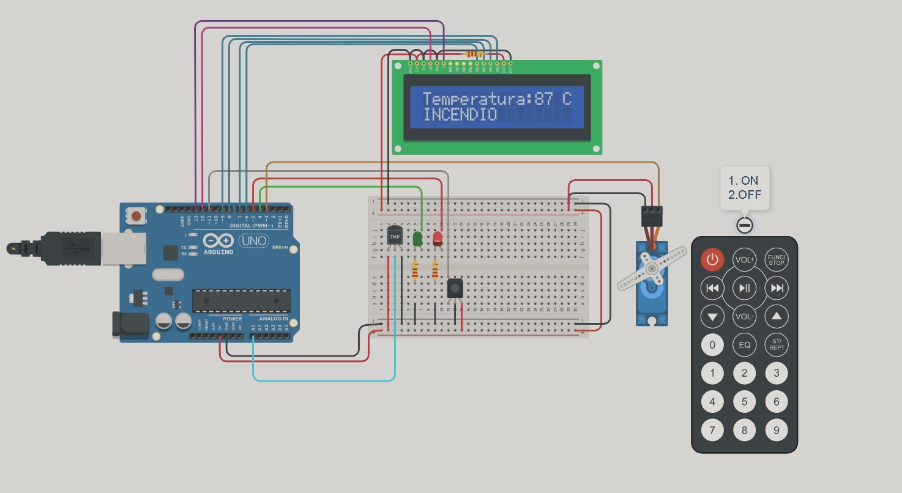

# Parcial2_spd_2023
<h2> Proyecto : Sistema de incendio con Arduino</h2>

<br>
## Descripcion
El proyecto es un modelo de un sistema de incendio utilizando Arduino que
detecta cambios de temperatura y activa un servo motor en caso de detectar un incendio.
Además, se mostrará la temperatura actual y la estación del año en un display LCD.

## Funcionamiento
<p>Se llama a la función manejarEntradaControlRemoto() para manejar las entradas del control remoto infrarrojo.Si el sistema está activado (sistemaActivado == true), se procede a verificar la temperatura y tomar acciones según el valor obtenido.Se utiliza la función verificarTemperatura() para leer el valor del sensor de temperatura y obtener la temperatura actual en grados Celsius.Si la temperatura es mayor que el umbral definido para incendio (temperatura > UMBRAL_INCENDIO), se activa el servo motor y se establece el estado de los LEDs para indicar una alerta de incendio. Se llama a la función activarServo() y se establece el estado de los LEDs con la función establecerEstadoLeds(1, 0).<br>
En cambio, si la temperatura no supera el umbral de incendio, se desactiva el servo motor y se establece el estado de los LEDs para indicar que no hay una alerta de incendio. Se llama a la función desactivarServo() y se establece el estado de los LEDs con la función establecerEstadoLeds(0, 1).
Por otro lado, si actualizarLcd es verdadero, se procede a imprimir la información en el LCD :<br>
Se imprime el texto "Temperatura:" en la primera línea del LCD utilizando miLcd.print("Temperatura:").<br>
Se coloca el cursor en la posición 15 de la primera línea del LCD utilizando miLcd.setCursor(15,0).<br>
Se imprime el símbolo "C" en la posición 15 de la primera línea del LCD utilizando miLcd.print("C").<br>
Se coloca el cursor en la posición (12,0) del LCD utilizando miLcd.setCursor(12,0).<br>
Se imprime el valor de la temperatura obtenida utilizando miLcd.print(temperatura).<br>
Se coloca el cursor en la posición (10,1) del LCD utilizando miLcd.setCursor(10,1).<br>
Se llama a la función printEstacion() para imprimir el nombre de la estación correspondiente según la temperatura actual.<br>

Pero si el sistema no está activado (sistemaActivado == false), se procede a desactivar el servo motor, establecer el estado de los LEDs en 0 y borrar el contenido del LCD.<br>
<br>
Sistema de incendio cuando esta desactivado.<br>
<br>
Sistema de alarma activado y servo en movimiento.<br>
 </p><br>

```bash
#include <IRremote.h> 
//permite recibir y transmitir señales de infrarrojos
#include <LiquidCrystal.h>
//funciones para escribir texto, números y controlar el cursor en la pantalla LCD
#include <Servo.h>
//para controlar servomotores

//SERVO
#define LED_ROJO 5
#define LED_VERDE 4
#define SENSOR A0
#define UMBRAL_INCENDIO 60
#define PIN_SERVO 3

int leds[] = {4,5};
Servo servo;//creo obj servo
int posicionServo;
bool direccionServo = false;

//LCD
#define RS 12
#define E  13
#define D4 6
#define D5 7
#define D6 8
#define D7 9
LiquidCrystal miLcd(RS,E,D4,D5,D6,D7);//creo obj de la clase y asigno pines
int actualizarLcd=1;
char estaciones[][10] = {"Invierno", "Otonio", "Primavera", "Verano","INCENDIO","         "};

//CONTROL REMOTO
#define Tecla_1 0xEF10BF00
#define Tecla_2 0xEE11BF00
#define Tecla_3 0xED12BF00
#define Tecla_4 0xEB14BF00
#define Tecla_5 0xEA15BF00
#define Tecla_6 0xE916BF00
//la biblioteca IRremote, que proporciona las funciones necesarias para recibir y decodificar señales infrarrojas
int IR = 11;// el receptor infrarrojo está conectado al pin 11 de la placa Arduino.
bool sistemaActivado = false;


void setup()
{
  for(int i=0;i<2;i++)
  {
    pinMode(leds[i], OUTPUT);//configuro los pines de salida
  }
  servo.attach(PIN_SERVO);//adjunto obj servo al pin
  
  miLcd.begin(16,2);//inicializa la pantalla LCD (16c x 2f)
  miLcd.setCursor(0,0);//posición del cursor- columna y fila
  
  IrReceiver.begin(IR, DISABLE_LED_FEEDBACK);//configura el ri  para recibir señales en el pin 11 y desactiva el LED de retroalimentación (DISABLE_LED_FEEDBACK).
}

void loop()
{
  manejarEntradaControlRemoto();
  
  if(sistemaActivado)
  {
    int temperatura = verificarTemperatura();

    if(temperatura > UMBRAL_INCENDIO)//cuando la temperatura sobrepase el umbral 
    {
      establecerEstadoLeds(1, 0);
      activarServo();
      //printAlerta();
    }
    else 
    {
      establecerEstadoLeds(0, 1);
      desactivarServo();
      //printEstacionesPorControl();
    }

    if(actualizarLcd)
      printMenu();
      miLcd.setCursor(12,0);//columna y fila
      miLcd.print("   ");
      miLcd.setCursor(12,0);
      miLcd.print(temperatura);
      miLcd.setCursor(10,1);
      printEstacion();
      delay(100);
  }
  else if(sistemaActivado == false)
  {
    establecerEstadoLeds(0, 0);
    desactivarServo();
    miLcd.clear();
  }
}

//FUNCIONES
void activarServo()
{
 
  if (posicionServo < 180 && !direccionServo)
    {
      posicionServo++;
    }
    else if (posicionServo > 0 || direccionServo)
    {
      direccionServo = true;
      posicionServo--;
      if (posicionServo <= 0)
      {
        direccionServo = false;
        posicionServo = 0;
      }
    }

    servo.write(posicionServo);
    delay(50);
}

void desactivarServo()
{
  servo.write(posicionServo);  
  delay(35);      
}

void printMenu(){
  actualizarLcd=0;
  miLcd.clear();
  miLcd.print("Temperatura:");
  miLcd.setCursor(15,0);
  miLcd.print("C");
}
void printEstacion()
{
  int temperatura = verificarTemperatura();
  miLcd.setCursor(0,1);
  miLcd.print(estaciones[5]);
  miLcd.setCursor(0,1);
  
  
  if(temperatura > 60)//INCENDIO +60
  {
    miLcd.print(estaciones[4]);
  }
  
   else if(temperatura > 40)//40-60
  {
    miLcd.print(estaciones[3]);
  }
  
   else if(temperatura > 20)//20-40
  {
    miLcd.print(estaciones[2]);
  }
  
  else if(temperatura >= 5)//5-20
  {
    miLcd.print(estaciones[1]);
  }
  
  else if(temperatura < 5)//-40-5
  {
    miLcd.print(estaciones[0]);
  }
 
}

int verificarTemperatura()
{
  int lecturaSensor = analogRead(SENSOR);
  int temperatura;
  
  temperatura = map(lecturaSensor,20,358,-40,125);
  //mapear el valor leído del sensor (lecturaSensor) de un rango a otro. 
  return temperatura;
}

void establecerEstadoLeds(int estadoRojo, int estadoVerde)
{
  digitalWrite(LED_ROJO, estadoRojo);
  digitalWrite(LED_VERDE, estadoVerde);
}

void manejarEntradaControlRemoto()
{
  if (IrReceiver.decode()) //si se ha decodificado una señal infrarroja
  {
    unsigned long valor = IrReceiver.decodedIRData.decodedRawData;//asigna el valor de la señal infrarroja decodificada 
    
    if (valor == Tecla_1) 
    {
      sistemaActivado = true;
      actualizarLcd=1;
      
    } 
    else if (valor == Tecla_2) 
    {
      sistemaActivado = false;
    }
    
    IrReceiver.resume();//seguir recibiendo señales
  }

}

void printEstacionesPorControl()
{
   miLcd.setCursor(0,1);
   miLcd.print(estaciones[5]);
   miLcd.setCursor(0,1);
   int index;
  
  
    unsigned long valor = IrReceiver.decodedIRData.decodedRawData;//asigna el valor de la señal infrarroja decodificada 
    
    if (valor == Tecla_3) 
    {
      index = 0;
    } 
    
    if (valor == Tecla_4) 
    {
      index = 1;
    }
    
    if (valor == Tecla_5) 
    {
      index = 2;
    }
    
    if (valor == Tecla_6) 
    {
      index = 3;
    }
    IrReceiver.resume();//seguir recibiendo señales
  
  miLcd.print(estaciones[index]);
   delay(100);
}
void printAlerta()
{
  miLcd.setCursor(0,1);
  miLcd.print(estaciones[4]);
  delay(100);
}
```


## Funciones
* void activarServo(): Esta función se encarga de activar el servo motor. Comienza verificando la posición actual del servo (posicionServo) y la dirección del movimiento (direccionServo). Si la posición actual es menor que 180 y la dirección no es verdadera (es decir, falso), incrementa la posición del servo. Si la posición actual es mayor que 0 o la dirección es verdadera, decrementa la posición del servo. Si la posición es menor o igual a 0, restablece la dirección a falso y establece la posición en 0. Finalmente, escribe la posición del servo usando servo.write(posicionServo) y espera 50 milisegundos.

* void desactivarServo(): Esta función se encarga de desactivar el servo motor. Simplemente escribe la posición actual del servo usando servo.write(posicionServo) y espera 35 milisegundos.

* void printMenu(): Esta función se encarga de imprimir un menú en el LCD. Primero establece una variable llamada actualizarLcd en 0, luego borra el contenido del LCD usando miLcd.clear(). A continuación, imprime el texto "Temperatura:" en la primera línea del LCD y coloca el cursor en la posición 15 de la primera línea. Luego, imprime el carácter "C" en esa posición.

* void printEstacion(): Esta función se encarga de imprimir información sobre la estación actual en el LCD. Primero, llama a la función verificarTemperatura() para obtener la temperatura actual. Luego, establece la posición del cursor en la segunda línea del LCD. A continuación, compara la temperatura con diferentes rangos y muestra el nombre de la estación correspondiente en función de la temperatura.

* int verificarTemperatura(): Esta función se encarga de leer un sensor de temperatura y convertir su valor en una temperatura en grados Celsius. Lee el valor del sensor utilizando analogRead(SENSOR), luego utiliza la función map() para convertir el valor leído del sensor a un rango de temperatura (-40 a 125 grados Celsius). Finalmente, devuelve el valor de temperatura calculado.

* void establecerEstadoLeds(int estadoRojo, int estadoVerde): Esta función se encarga de establecer el estado de dos LEDs (uno rojo y uno verde). Recibe dos parámetros: estadoRojo y estadoVerde, que deben ser valores HIGH o LOW. Utiliza digitalWrite() para establecer el estado de los LEDs.

* void manejarEntradaControlRemoto(): Esta función se encarga de manejar las entradas de un control remoto infrarrojo. Utiliza la biblioteca IrReceiver para decodificar las señales infrarrojas. Si se ha decodificado una señal, obtiene el valor decodificado y realiza una serie de comparaciones con diferentes teclas del control remoto. Dependiendo del valor recibido, establece el estado del sistema y actualiza una variable actualizarLcd. Finalmente, llama a IrReceiver.resume() para seguir recibiendo señales.

* void printEstacionesPorControl(): Esta función se encarga de imprimir la información de una estación seleccionada a través del control remoto infrarrojo. Al igual que en manejarEntradaControlRemoto(), utiliza la biblioteca IrReceiver para obtener el valor decodificado del control remoto. Según el valor recibido, establece un índice para seleccionar una estación específica del arreglo estaciones[] y la imprime en el LCD. También hay un retraso de 100 milisegundos al final.

* void printAlerta(): Esta función se encarga de imprimir una alerta en el LCD. Simplemente muestra el nombre de la estación correspondiente a una alerta (por ejemplo, "INCENDIO") en la segunda línea del LCD y hay un retraso de 100 milisegundos al final.
## Circuito Esquematico

## Link del proyecto
[Parcial 2 SPD](https://www.tinkercad.com/things/jMK0zgReULG)

